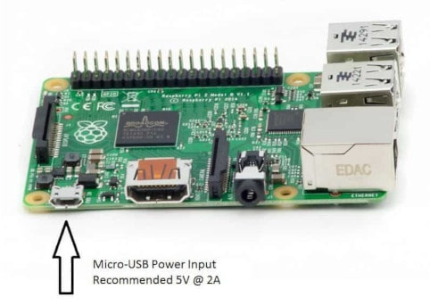

# workshop rgb led
Material for raspberry pi workshop

# Wiring


|Sensor             | Raspberry pi                 |
|-------------------|---------------------------------|
|-                  | GND pin                         |
|Blue               | GPIO 23                         |
|Green              | GPIO 24                         |
|Red                | GPIO 25                         |

# Code

## 1- Power your raspberry

You can achive it with connecting it to your pc trought the Micro USB Port of the raspberry pi



## 2- Connect to your raspberry pi
Using putty if you're on windows, Ssh if you're on a linux based os
Follow the following instruction if you dont know how to connect to raspberry pi
[Connect to raspberry pi using Putty](https://github.com/ionoid-io-projects/workshop/blob/master/doc/od-iot-raspbian-rpi-zero-windows.md#5-first-boot)

## 3- Download relay binary file

Assuming you're connected with... copy and past this command
If you're using Raspberry zero
```
curl -O https://raw.githubusercontent.com/ionoid-io-projects/workshop_rgb_led/master/bin/arm6/rgb
```

If you're using Raspberry 3 b
```
curl -O https://raw.githubusercontent.com/ionoid-io-projects/workshop_rgb_led/master/bin/arm7/rgb
```
## make it executable
```
chmod +x rgb
```

## 4- execute binary
```
./rgb
```

You can call one of those color green, red, orange  

## How to stop the program
To quit or stop the program click on **Ctrl+C**

# Ressources
https://www.piddlerintheroot.com/rgb-moisture-sensor/

